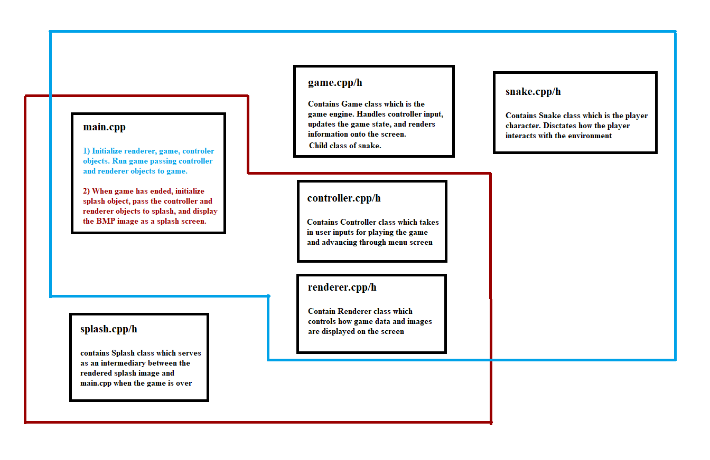

# SNAKE

This is my capstone project for the [Udacity C++ class](https://www.udacity.com/course/c-plus-plus-nanodegree--nd213) and builds upon a provided [Snake game repo.](https://github.com/udacity/CppND-Capstone-Snake-Game)

## Overview:
I have taken the base game and improved it. Not in terms of gameplay, or performance, or functionality, but in UI.
My changes are as follows:
- Pressing the escape key when playing the game allows a player to exit.
- Ending the game will display a splash screen BMP rather than ungracefully crashing out of the program.
- When the game window closes, a CSV file is written to which saves the player score. This CSV is then dumped out to the terminal via a system call.

## File and Class Diagram

## Building and Running
To build, navigate to the directory "CppND-Capstone-Snake-Game\build" and run the command "make".
Then launch the resultant binary with the command "./SnakeGame".
No additional libraries are needed to run build and run the code.

## Normal Operation
When the binary is launched, a window will pop up which contains the snake game.
From here, a player may play the game until they eat their tail, or press the "Escape" button at any time to end the game.
Regardless of how the game ends, a splash screen is displayed.
Upon pressing the "Enter" key, the window closes, the player's score is saved to a CSV and read out to the player.
The program ends.

## Rubric Points
1. Project writes data to a file, program writes data to a file. [main.cpp: lines 8, 30-37; renderer.cpp: lines 83-99]
2. Project accepts user input and processes the input. [controller.cpp: lines 12-32, 43-45]
3. Overloaded functions allow the same funciton to operate on different parameters. [controller.cpp: lines 12-68]
4. Classes use appropriate access specifiers for class members. [splash.h: lines 9-21]
5. Project uses Object Oriented Programming techniques [splash.h: lines 9-21; splash.cpp: lines 8-24]

## Acknowlegements
Thank you to [LazyFoo](https://lazyfoo.net/tutorials/SDL/02_getting_an_image_on_the_screen/index.php) for the SDL tutorial, The Raymond Corporation for sponsoring this class, and of course [Rat Movie: Mystery of the Mayan Treasure](https://www.youtube.com/watch?v=jAXioRNYy4s&t=330s)
